#  ZOOLOGICO CAMPUS


**Funcionamiento de un Zoológico a Nivel Comercial:**


1. **Comercial:**
   - Ventas y Marketing: Promoción de eventos, boletos de entrada, membresías y actividades especiales para atraer visitantes.
   - Tiendas de Regalos: Operación de tiendas donde se venden souvenirs, ropa y juguetes relacionados con los animales.
   - Gastronomía: Restaurantes, cafeterías y áreas de comida para ofrecer opciones alimenticias a los visitantes.

---

# Análisis de Requerimientos para el proyecto de en un Zoológico:

1. **Compras y Pedidos:**
   - Compra de boletos y membresías.
   - Compra de alimentos y souvenirs.
2. **Información sobre Animales y Exhibiciones:**
   - Detalles de cada especie y exhibición.
   - Información educativa sobre los animales.
3. **Educación y Programas:**
   - Detalles de programas educativos y visitas guiadas.
   - Recursos educativos para maestros y estudiantes.
4. **Gestión de Eventos:**
   - Reserva de eventos y servicios para ocasiones especiales.

# DATABASE A USAR

Este es el esquema de la base de datos en <span style="color:orange;">MongoDB</span> 
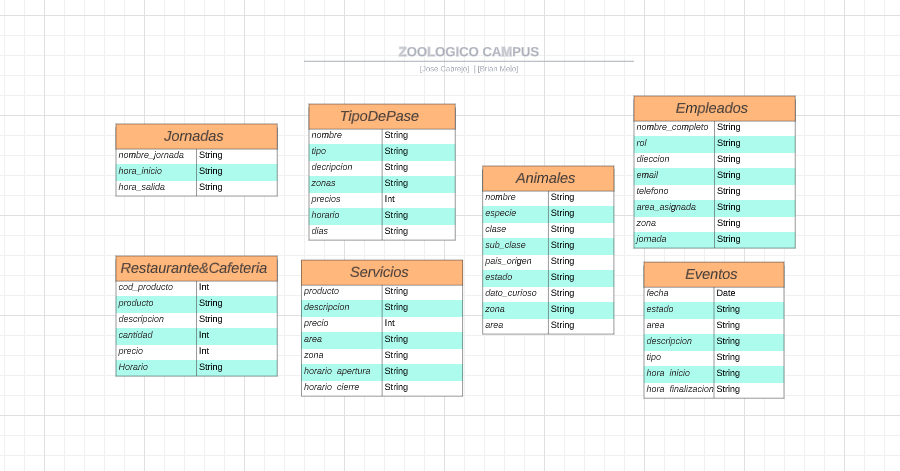<br><br>


# DEPENDENCIAS IMPLEMENTADAS

```JSON
      "devDependencies": {
         "express-rate-limit": "6.9.0",
         "express-routemap": "1.6.0",
         "express-session": "1.17.3",
         "express-validator": "7.0.1",
         "jose": "4.14.4",
         "passport": "0.6.0",
         "passport-http-bearer": "1.0.1"
      },
      "dependencies": {
            "cors": "^2.8.5",
            "dotenv": "16.3.1",
            "express": "4.18.2",
            "express-routes-versioning": "^1.0.1",
            "helmet": "^7.0.0",
            "mongodb": "5.7.0",
            "morgan": "^1.10.0"
      }
```
<br><br>

# IMPLEMENTACION PROYECTO

### CLONACION DEL REPOSITORIO

Clonamos el repositorio con visual estudio code y lo guardamos en una carpeta de nuestra elección

```
https://github.com/DatBrian/zoologico_campus
```

<br><br>

### INSTALACION DE DEPENDENCIAS

Para Usar las Dependencias que estan en el package.json :
```
npm install
```
<br><br>

# CONFIGURACION DEL .env

Dentro de la Ruta que creamos para alojar el proyecto buscamos  el  archivo llamado [.env.example](.env.example)  y lo cambiamos por ".env"
En el archivo .env, configurar las siguientes variables de conexión a la base de datos:
```
HOST = localhost
PORT = 5000
API_VERSION = v1

DB_USER = ""
DB_NAME = ""
DB_PASSWORD = ""

JWT_PRIVATE_KEY= ""
```
En el campo de MY_SERVER ingrese un hostname y un puerto a su elección(preferiblemente mayor al 5000). Recuerde que por defecto el local host requiere que el hostname es 127.0.0.1. pero puede ser,
ATLAS_USER es el usuario de la base de datos registrado en Atlas y ATLAS_PASSWORD es la contraseña que le asignamos, ATLAS_DB es el nombre de la base de datos y el JWT_PRIVATE_KEY es la palabra secreta que usaremos para generar los tokens de JWT(a su elección)


<br><br>


# INSTALACION BASE DE DATOS

## Primer Metodo: Desde La Extension de MongoDB para Visual Studio Code

Teniendo una cuenta en MongoDB Atlas, ya registrado indicado en la documentacion
https://github.com/JoseCabrejoVillarCampus/mongoDocumentacion

Nos dirigimos la carpeta [db](/src/db), en el archivo  [query.mongodb](src/db/query.mongodb)
aca observaremos que para crear las coleciones, hemos realizado esquemas para la verificacion de tipo y patrones de datos

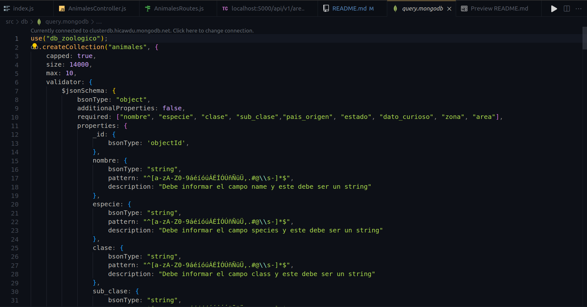<br><br>

Procedemos a ejecutarlo uno por uno, en este caso hemos puesto la creacion de la colecion y la insercion de datos para cada una seguidamente, vasta con seleccionar la coleccion y dar en el boton "RUN" alojado en la esquina derecha superior

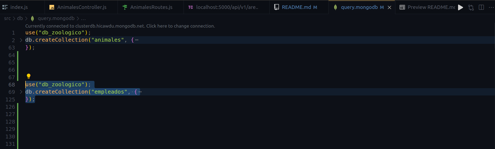<br><br>

Diseño para la insercion de varios Datos para la tabla correspondiente alojasod en [db](src/db), en el archivo [queryDatos.mongodb](src/db/queryData.mongodb), la ejecutamos de forma igual a la creacion de la coleccion

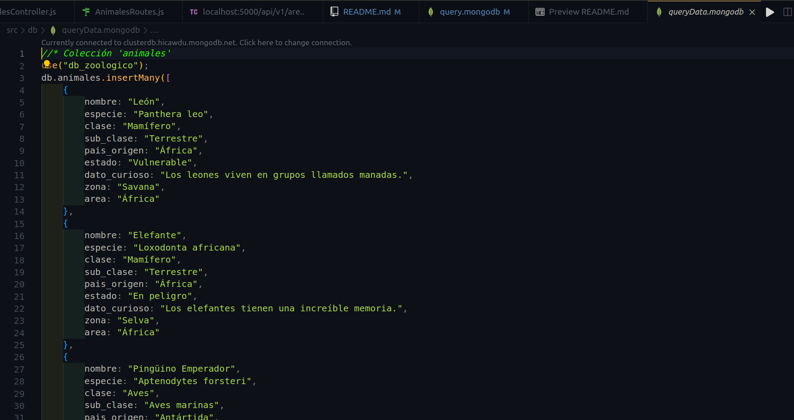<br><br>

## Segundo Metodo: Usuario Temporal

Se creo un usaurio temporal para acceder a la base de datos original con las colecciones ya creadas y sus respectivos inserts
de prueba, para esto hay que ingresar en las variables de entorno dentro del archivo [.env](.env)

Hemos Creado un Usuario con acceso a la db de Moongo para el testeo:

```
HOST = localhost
PORT = 5000
API_VERSION = v1

DB_USER = miguel
DB_NAME = db_zoologico
DB_PASSWORD = miguel

JWT_PRIVATE_KEY= ""
```

## Tercer Metodo: Generacion Automatizada de generacion de Esquemas, Colecciones e Inserts (by Brian Kaleth Melo)

En este metodo consiste en generar automaticamente todos los esquemas y colecciones con sus respectivos datos de prueba al levantar el servidor, para utilizar este metodo, tendras que tener un cluster activo en mongoDB, donde se va a configurar la base de datos, Teniendo una cuenta en MongoDB Atlas, ya registrado indicado en la documentacion
https://github.com/JoseCabrejoVillarCampus/mongoDocumentacion.

Tener en cuenta que debemos configurar las variables de entorno con los respectivos datos de nuestro Atlas, en nuestro archivo [.env.example](.env.example), retiramos (.example) y dejamos solo ".env"


```js 
    HOST = localhost
    PORT = 5000
    API_VERSION = v1

    DB_USER = ""
    DB_NAME = ""
    DB_PASSWORD = ""
    DB_CLUSTER = ""

    JWT_PRIVATE_KEY= ""
```


 Los primeros 3 datos se pueden dejar intactos y de preferencia no alterarlos por su seguridad. Los demás datos se obtienen directamente de la cadena de conexión generada en atlas, a continuación se muestra el paso a paso para dicho proceso:

## 1. Iniciar Sesión en atlas:

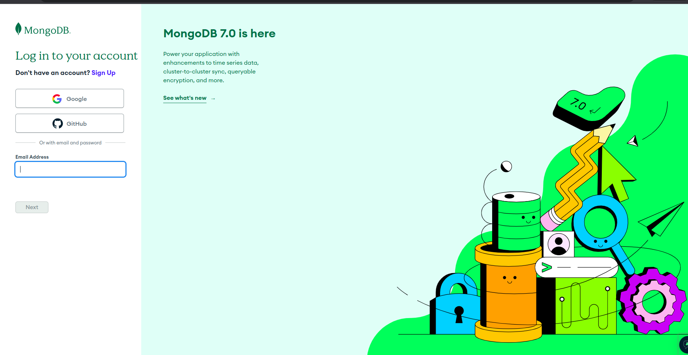


## 2. Buscar el cluster a usar y entra:

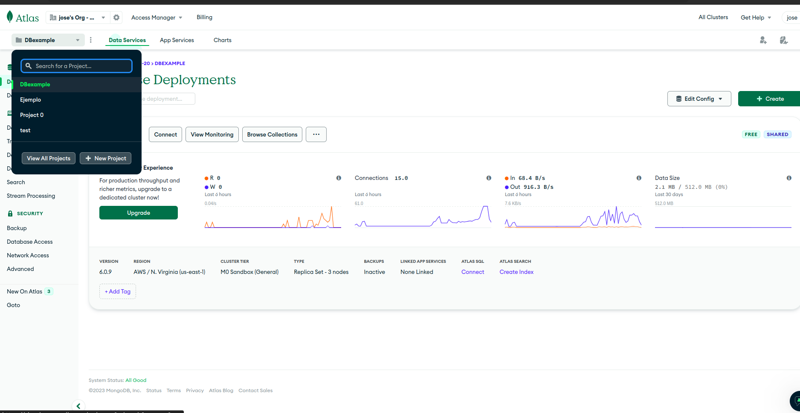

## 3. Entra a la opción de conectar para obtener la cadena de conexión con el respectivo driver:

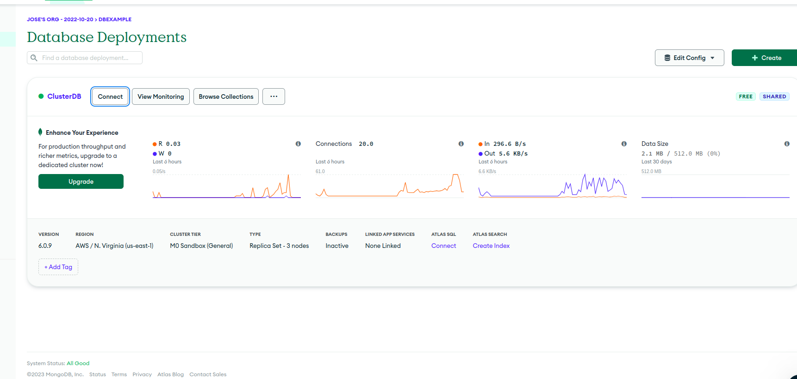

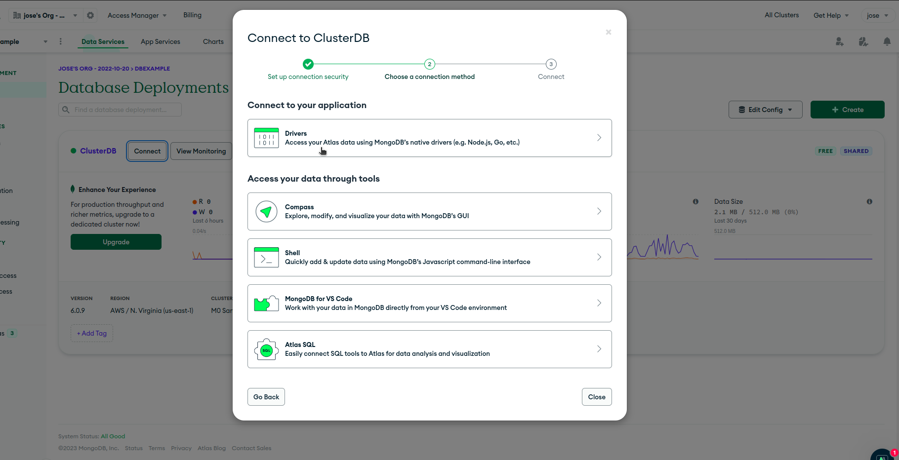

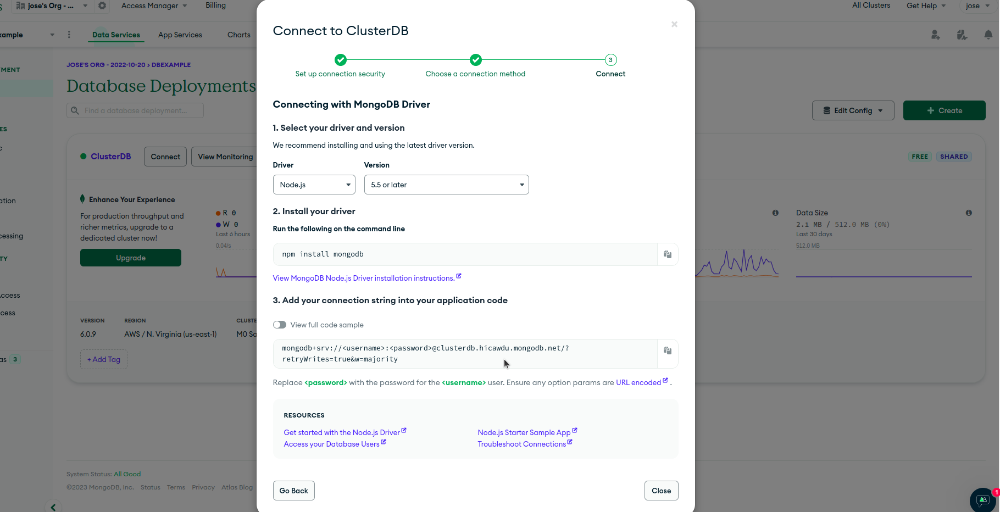

## 4. Si vas a instalar la base de datos en tu propio cluster copia la cadena de conexión y insertala

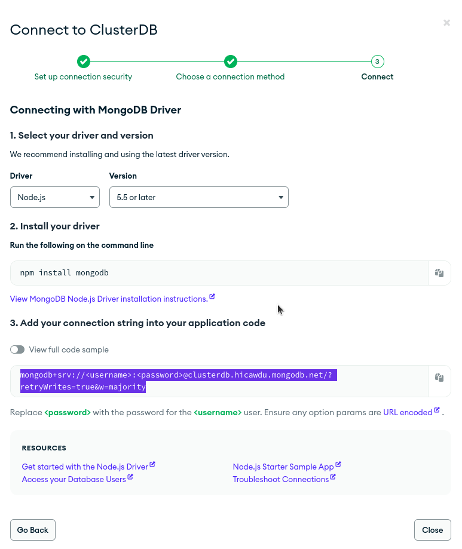

<span style="color:green;">Cluster</span>

```js
mongodb+srv://<username>:<password>@clusterdb.hicawdu.mongodb.net/?retryWrites=true&w=majority
```

Correcto <span style="color:green;">Cluster con las Constantes de las Varibles de Entorno</span>

```js
mongodb+srv://${DB_USER}:${DB_PASSWORD}@${DB_CLUSTER}.${DB_IDENTIFIER}.mongodb.net/?retryWrites=true&w=majority
```

<span style="color:green;">Variables de Entorno</span>

```js
  HOST = localhost
  PORT = 5000
  API_VERSION = v1

  DB_USER = cabre920903
  DB_NAME = db_zoologico
  DB_PASSWORD = onepiece
  DB_CLUSTER = clusterdb
  DB_IDENTIFIER = hicawdu

  JWT_PRIVATE_KEY= zooCampus
```

# INICIAR nodemon

```js
npm run start:dev
```
<br><br>

# INSTALACION COLECCIONES USUARIO Y LOGIN

 Vamos a crear las colecciones <span style="color:green;">usuario</span> , <span style="color:green;">login</span> , <span style="color:green;">rol</span>,para la validacion por token del portador segun la strategia [http-passport-bearer](https://www.passportjs.org/packages/passport-http-bearer/), en nuestro proyecto [passPortHelper](src/helpers/passPortHelper.js), ademas de otras pequeñas cosas, que simplemente ahi que ejecutar con el boton RUN

Para la Coleccion <span style="color:blue;">"usuario"</span>

```
http://localhost:5000/api/v1/auth/signup
```

```js
   {
    "username":"",
    "password": "",
    "role":[0],// el numero segun el rol
    "permisos":{
      "/animales" : "1.0.0"
    }
  }
```

<span style="color:green;">Usuario Autorizado para todos las Rutas</span>
con este usuario tendremos un usuario de testeo

```js
{
    "username":"Micky",
    "password": "Montana",
    "role":[1],
    "permisos":{
      "/api/v1/animales" : [
        "1.0.0",
        "1.0.1",
        "1.0.2",
        "1.0.3",
        "1.0.4",
        "1.0.5",
        "1.0.6",
        "1.0.7",
        "1.0.8",
        "1.0.9",
        "1.1.0"
        ],
        "/api/v1/pases" : [
        "1.0.0",
        "1.0.1",
        "1.0.2",
        "1.0.3",
        "1.0.4",
        "1.0.5",
        "1.0.6",
        "1.0.7",
        "1.0.8",
        "1.0.9",
        "1.1.0"
        ],
        "/api/v1/empleados" : [
        "1.0.0",
        "1.0.1",
        "1.0.2",
        "1.0.3",
        "1.0.4",
        "1.0.5",
        "1.0.6",
        "1.0.7",
        "1.0.8",
        "1.0.9",
        "1.1.0"
        ],
        "/api/v1/jornadas" : [
        "1.0.0",
        "1.0.1",
        "1.0.2",
        "1.0.3",
        "1.0.4",
        "1.0.5",
        "1.0.6",
        "1.0.7",
        "1.0.8",
        "1.0.9",
        "1.1.0"
        ],
        "/api/v1/servicios" : [
        "1.0.0",
        "1.0.1",
        "1.0.2",
        "1.0.3",
        "1.0.4",
        "1.0.5",
        "1.0.6",
        "1.0.7",
        "1.0.8",
        "1.0.9",
        "1.1.0"
        ],
        "/api/v1/restauranteCafeterias" : [
        "1.0.0",
        "1.0.1",
        "1.0.2",
        "1.0.3",
        "1.0.4",
        "1.0.5",
        "1.0.6",
        "1.0.7",
        "1.0.8",
        "1.0.9",
        "1.1.0"
        ],
        "/api/v1/eventos" : [
        "1.0.0",
        "1.0.1",
        "1.0.2",
        "1.0.3",
        "1.0.4",
        "1.0.5",
        "1.0.6",
        "1.0.7",
        "1.0.8",
        "1.0.9",
        "1.1.0"
        ]
    }
  }
```


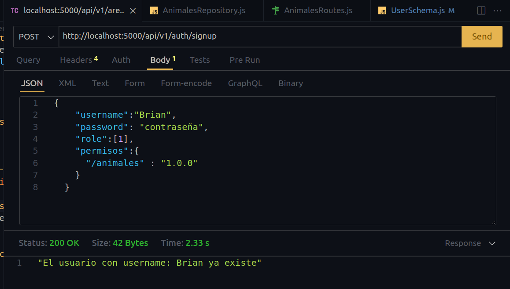


## Inicio de sesion

```js
  http://localhost:5000/api/v1/auth/signin
```

```js
   {
  "username": "Brian",
  "password" : "contraseña"
}
```

Correcto <span style="color:green;">[1.0.0]</span>

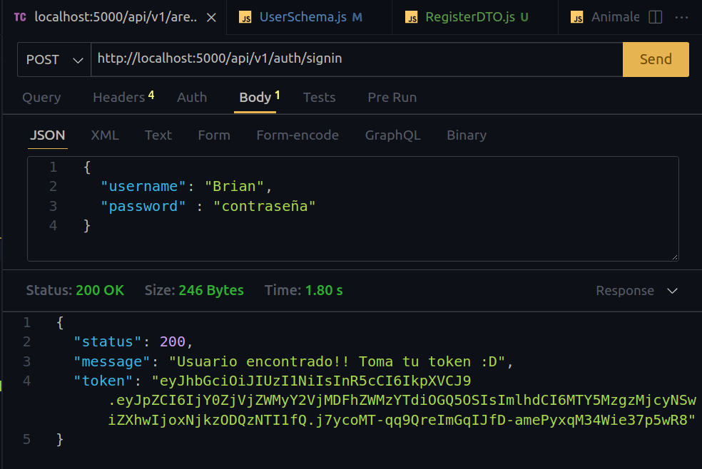

Incorrecto <span style="color:green;">[1.0.0]</span>

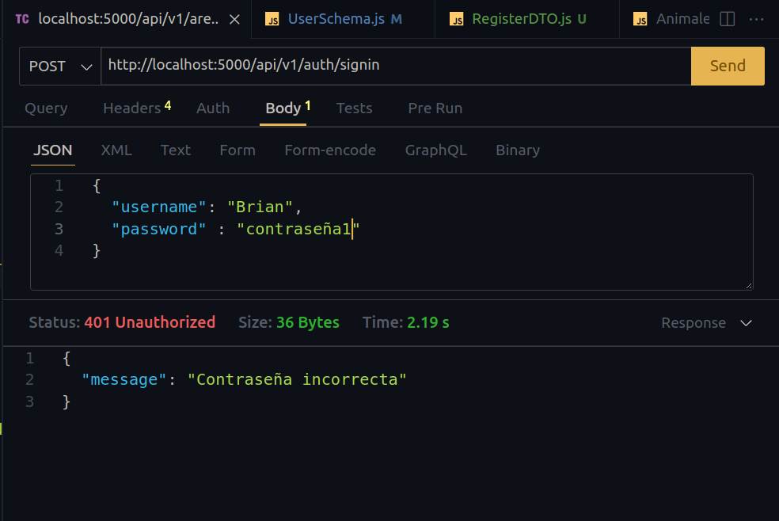


# GENERACION DE TOKEN DE ACCESO

En esta ocacion, hemos generado un token de acceso unico para cada usuario, basandonos en su esquema, rol y  permisos, este codigo lo podemos observar dentro de la carpeta [helpers](src/helpers), en el archivo [JWT.js](src/helpers/JWT.js)

Generar Token de acceso 

- Generación: Una vez dentro del cliente que estemos usando,("En este caso estamos ejecutando en thunderClient"), a traves
del metodo POST

```js
  http://localhost:5000/api/v1/auth/signin
```

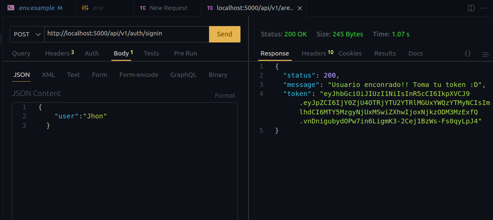<br><br>

Donde debemos pasarle un body con un nombre que tengamos creado ya en la base de datos, dentro de la coleccion cliente, tambien vemos los permisos para las versiones que este tiene:

```js
  {
    "nombre": "Jhon"
  }
```
```js
  {
    "nombre": "Marcos"
  }
```
<br><br>


Este token tiene un limite de tiempo, en ese rango de tiempo podremos acceder a las rutas y endPoints de nuestra Api. Una vez pasada esta hora será necesario generar uno nuevo.<br><br>

## IMPLEMENTACION DEL TOKEN DE PORTADOR

Aca observamos la aplicacion de los permisos a las versiones segun el token del portador para cada usuario

Correcto <span style="color:green;">[1.0.0]</span>

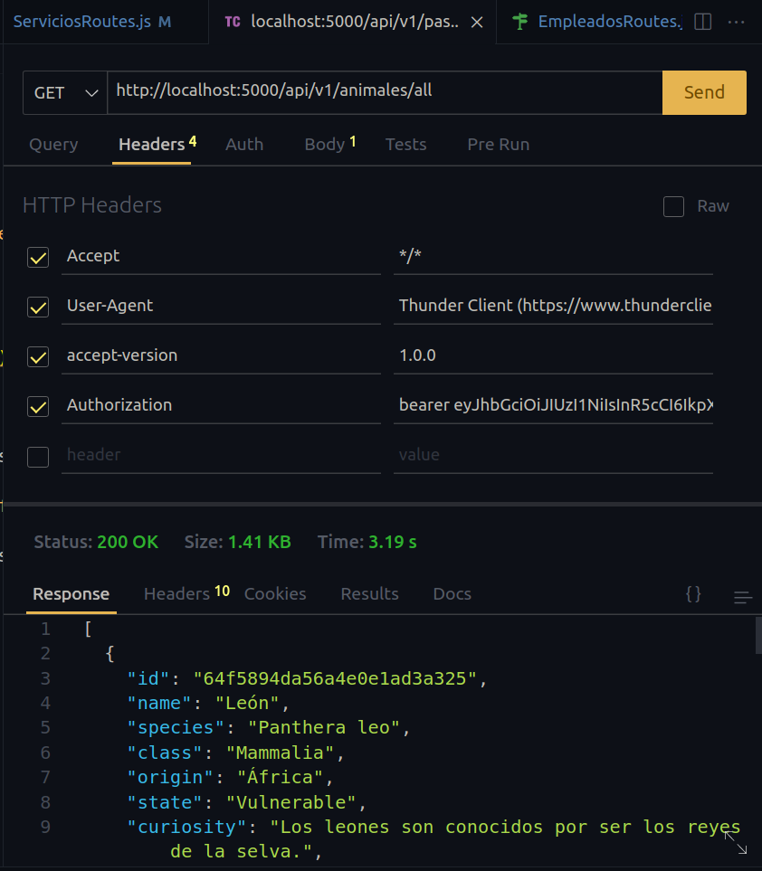


Incorrecto <span style="color:green;">[1.0.0]</span>

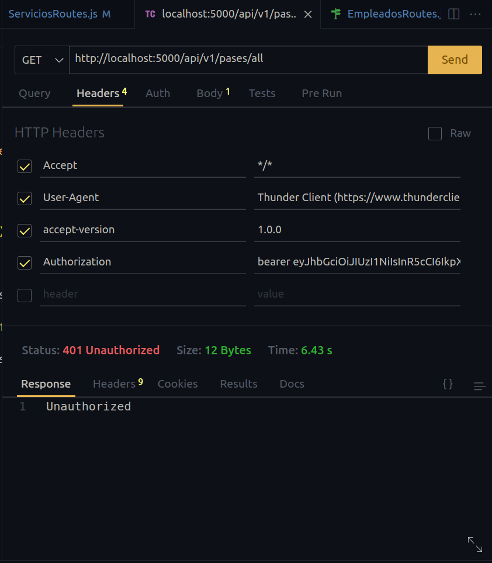

# CONSULTAS<br><br>


## FUNCIONAMIENTO Y ENDPOINTS.<br><br>


**CRUD DE LAS COLECCIONES**
Los siguiente endPoints corresponden a los CRUDs de cada coleccion, **es importante recordar que para realizar los metodos debimos generar anteriormente el token de usuario y tener los permisos, en este caso Accept-Version de las rutas**.
Para estos endPoints se pueden realizar las consultas básicas, get, get by id, post, put y delete.
<br><br>

* Es importante tener en cuenta que estamos manejando versiones para los metodos y permisos, por esto es importante saber que versiones
maneja cada metodo, estas se pasan por el header, de la siguiente manera:

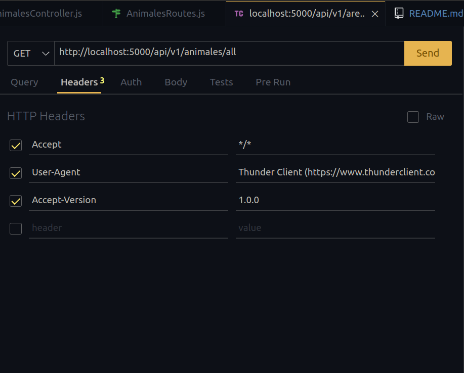<br><br>

* EndPoint CRUD de la Tabla db_zoologico:
Estos funciona dentro del cliente que deseemos usar<br>

* Estas son las colecciones disponibles para usar en las url de consulta:

```js
   Colecciones Disponibles:
   -animales
   -empleados
   -eventos
   -jornadas
   -pases
   -restauranteCafeterias
   -servicios
```

## Metodo GET  para todas las Colecciones:

En la version <span style="color:green;">[1.0.0]</span>

```js
  http://${config.hostname}:${config.port}/api/v1/{**coleccion**}/all
```


<br><br> 

## Metodo GET BY ID para todas las Colecciones:

En este caso, la ruta GET, nos sirve para varias consultas, solo agregandole parametros opcionales, como id en este caso y otra version nos 
redirige a otra ruta

En la version <span style="color:green;">[1.0.1]</span>

```js
  http://${config.hostname}:${config.port}/api/v1/{**coleccion**}/all?id=(**ObjectId del objeto a consultar**)
```

Aunque tambien lo podemos pasar segun nuestro cliente (thunder client), de la siguiente forma:


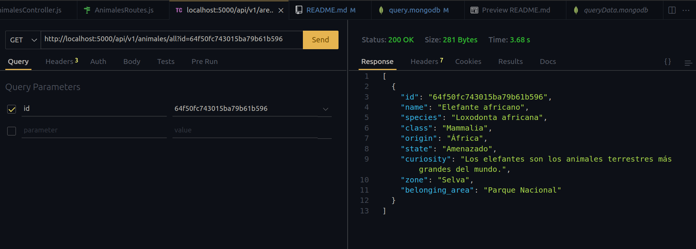


<br><br>

## PARA LAS CONSULTAS POR POST Y PUT, ES NECESARIO UN CUERPO(BODY), ACA ESPECIFICAREMOS COMO REALIZARLAS EN CADA COLECCION,
TODAS EN LA VERSION [1.0.0]:


Para la Coleccion <span style="color:blue;">"animales"</span>
```js
   {
    "name": "String",
    "species": "String",
    "class": "String",
    "sub_class":"String"
    "origin": "String",
    "state": "String",
    "curiosity": "String",
    "zone": "String",
    "belonging_area": "String"
  }
```
<br><br>
Para la Coleccion <span style="color:blue;">"empleados"</span>

```js
   {
    "complete_name": "String",
    "assigned_position": "String",
    "address": "String",
    "Email": "juan@example.com",
    "phone_number": "123-456-7890",
    "belonging_area": "String",
    "zone": "String",
    "schedule": "String"
  }
```

<br><br>
Para la Coleccion <span style="color:blue;">"jornadas"</span>

```js
   {
    "schedule": "String",
    "entry_time": "00:00 am",
    "departure_time": "00:00 pm"
  }
```

<br><br>
Para la Coleccion <span style="color:blue;">"pases"</span>

```js
   {
    "name": "String",
    "type": "String",
    "description": "String",
    "zone": "String",
    "prices": 0,
    "schedule": "00:00 am - 00:00 pm",
    "days_opening": "String"
  }
```

<br><br>
Para la Coleccion <span style="color:blue;">"restauranteCafeterias"</span>

```js
   {
    "product": "String",
    "description": "String",
    "amount": 000,
    "price": 000000,
    "place": "String",
    "schedule": "String"
  }
```


<br><br>
Para la Coleccion <span style="color:blue;">"servicios"</span>

```js
   {
    "producto": "String",
    "descripcion": "String",
    "precio": 000000,
    "area": "String",
    "zona": "String",
    "horario_apertura": "00:00 am",
    "horario_cierre": "00:00 pm"
  }
```

<br><br>
Para la Coleccion <span style="color:blue;">"eventos"</span>

```js
   {
    "date": "0000-00-00",
    "state": "String",
    "belonging_area": "String",
    "description_info": "String",
    "start_time": "00:00 am",
    "end_time": "00:00 pm"
  }
```


## Metodo POST para todas las Colecciones

En la version <span style="color:green;">[1.0.0]</span>

```js
  http://${config.hostname}:${config.port}/api/v1/{**coleccion**}/insert
```

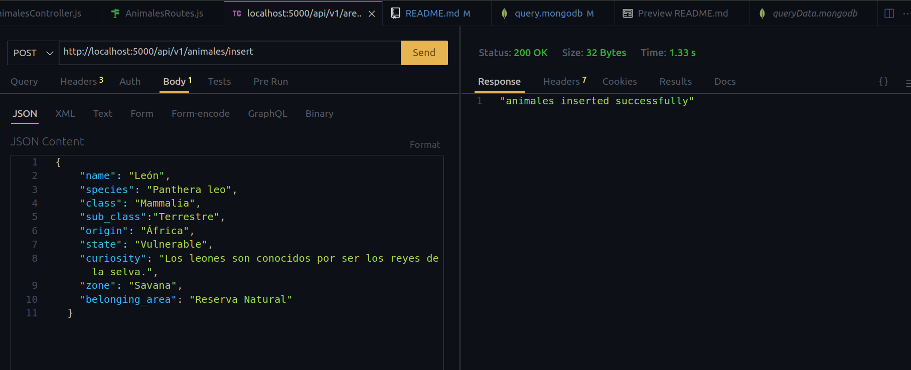

<br><br>

## Metodo PUT para todas las colecciones:

En la version <span style="color:green;">[1.0.0]</span>

```js
  http://${config.hostname}:${config.port}/api/v1/{**coleccion**}/update?id=(**ObjectID**)
```
<br><br>

En este caso es necesario pasar un id, similar a como lo hicimos en el metodo GET BY ID, ademas de enviarle un cuerpo, segun la coleccion.

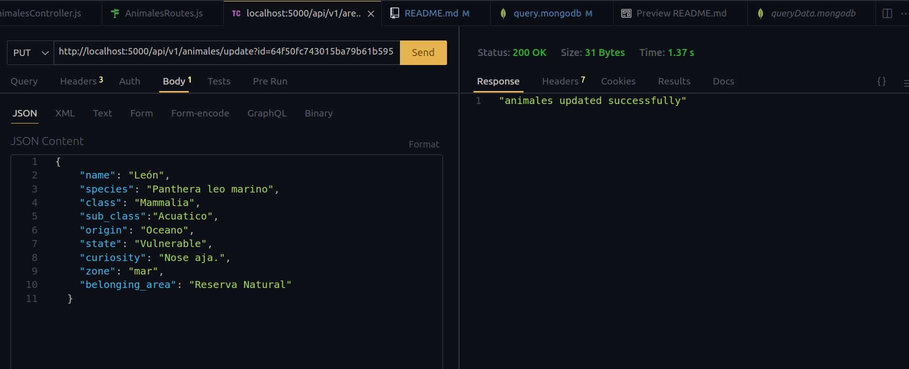


## Metodo DELETE para todas las Colecciones:

En la version <span style="color:green;">[1.0.0]</span>

```js
  http://${config.hostname}:${config.port}/api/v1/{**coleccion**}/delete?id=(**ObjectID**)
```

Aca solo debemos pasarle una Query por id, similar al PUT y al GET BY ID, pero sin pasarle un cuerpo(body)

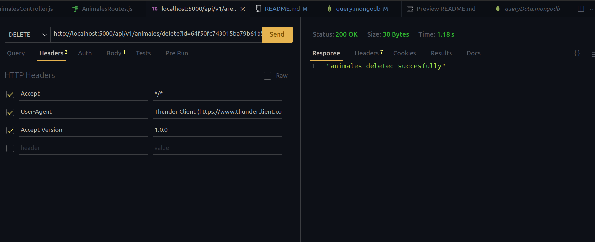

<br><br>


<span style="color:green;">Adicional ahora debemos enviar en los Headers, la version y el token</span><br><br>

<span style="color:blue;">EJEMPLO:</span><br><br>

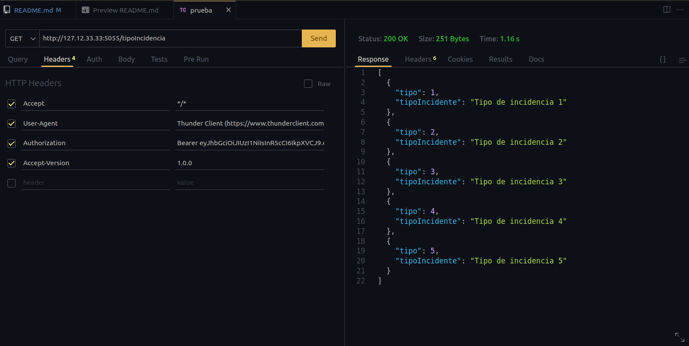<br><br>

Ahora, las versiones disponibles para los Crud normales son

```js
  version:[1.0.0]
```
<br><br>

# CONSULTAS ESPECIFICAS

## Listar los animales en el Zoologico por Orden Alfabetico

En la version <span style="color:green;">[1.0.2]</span>

```js
  http://${config.hostname}:${config.port}/api/v1/animales/all
```

## Listar los animales por clase (Ejemplo: Mamífero)

En la version <span style="color:green;">[1.0.3]</span>

```js
  http://${config.hostname}:${config.port}/api/v1/animales/all?clase=Mamífero
```

## Listar los animales por sub clase

En la version <span style="color:green;">[1.0.4]</span>

```js
  http://${config.hostname}:${config.port}/api/v1/animales/all?sub_clase=Theria
```

## Listar animales por zona en el zoologico(Savana,Selva, Antártida,Bosque tropical, Océanos del mundo, 
## Hielo polar, Río, Bosque de bambú)

En la version <span style="color:green;">[1.0.5]</span>

```js
  http://${config.hostname}:${config.port}/api/v1/animales/all?zona=Bosque
```

## Listar animales por sub_clase y estado

En la version <span style="color:green;">[1.0.6]</span>

```js
  http://${config.hostname}:${config.port}/api/v1/animales/all?sub_clase=Theria&estado=Vulnerable
```

## Empleados por Jornada

En la version <span style="color:green;">[1.0.2]</span>
```js
  http://${config.hostname}:${config.port}/api/v1/empleados/all?jornada=Mañana
```

## Empleados por cargo y area (Fotógrafo, Captura de momentos)

En la version <span style="color:green;">[1.0.3]</span>
```js
  http://${config.hostname}:${config.port}/api/v1/empleados/all?cargo=Fotógrafo&?area=Captura%20de%20momentos
```

## Proximos Eventos

En la version <span style="color:green;">[1.0.2]</span>
```js
  http://${config.hostname}:${config.port}/api/v1/eventos/all?estado=Próximo
```

## Eventos Matiné

En la version <span style="color:green;">[1.0.3]</span>
```js
  http://${config.hostname}:${config.port}/api/v1/eventos/all
```

## Listar Pases Por Tipo (Taller, Entrada,Suscripción,Actividad)

En la version <span style="color:green;">[1.0.2]</span>
```js
  http://${config.hostname}:${config.port}/api/v1/pases/all?tipo=Atracción
```

## Listar Pases Por Precio menor o igual 30000

En la version <span style="color:green;">[1.0.3]</span>
```js
  http://${config.hostname}:${config.port}/api/v1/pases/all
```

# TECNOLOGIAS USADAS

<div>


</div>

# EXTENSIONES USADAS

MongoDB for VS Code

### Autores : 
Brian Kaleth Melo Arroyo
Jose Alberto Cabrejo Villar